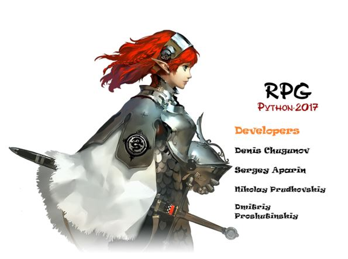

RPG-game
===

**Игра в стиле RPG созданная на pygame**

## Цели проекта
* Познакомиться с инструментами Python для создания игровых процессов
* Разобраться с работой TCP/UDP – серверов
* Написать многопользовательскую сетевую игру
* Научиться разрабатывать продукт в команде

## Распределение ролей
|Денис | Николай | Дмитрий | Сергей |
|---|---|---|---|
|написание игрового цикла| написание TCP/UDP - серверов|визуальная составляющая битвы|сам механизм битвы|
|дизайн|работа с БД|||
|создание карт внешнего мира|логирование|||

## Использовали
* 

* 

* **peewee** - orm для взаимодействия с БД

* 

## Как это выглядит
### регистрация

## Инструкция
Чтобы запустить игру, запустите Runner.py и выбирайте offline режим.

Если вы хотите запустить игру в сети, то запустите cервера server_TCP.py и
server_UDP.py на своем хосте.

Измените поле HOST в others.py на адрес вашего хоста.
Затем уже запускайте Runner.py
