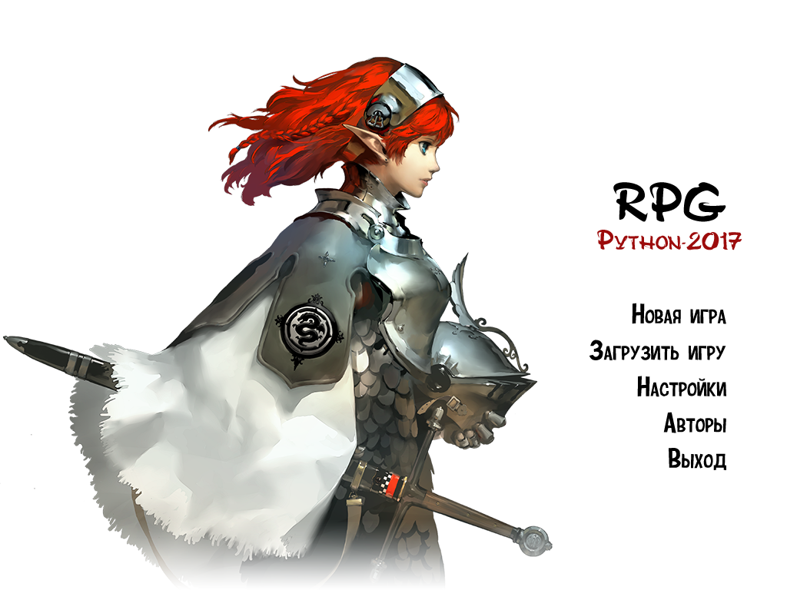
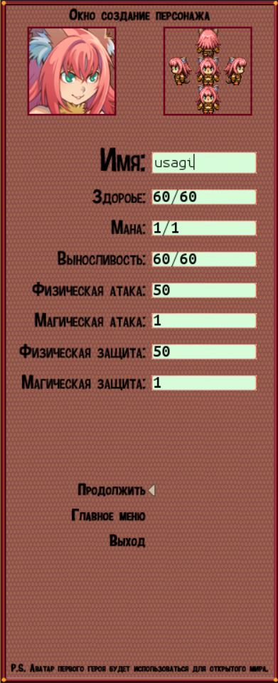
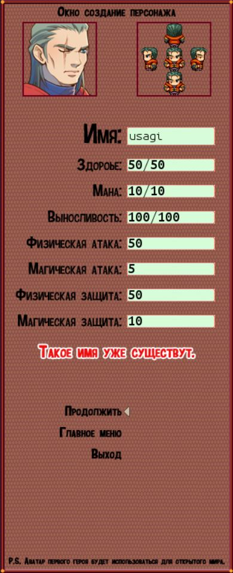
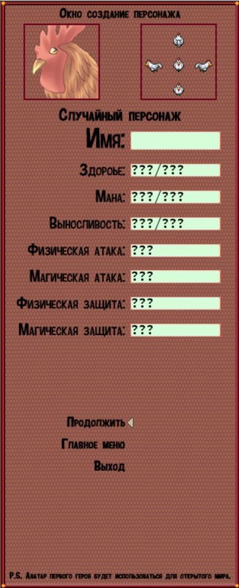
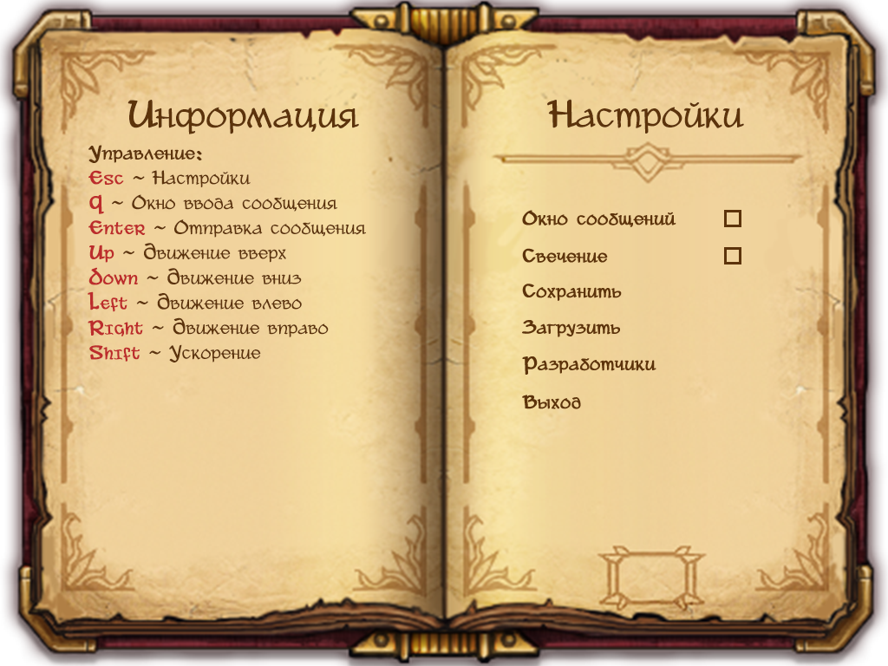
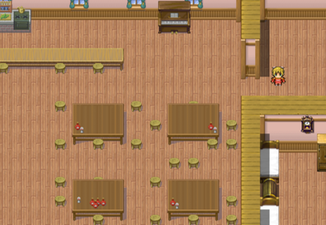
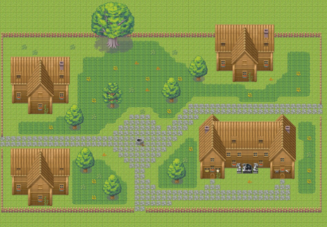
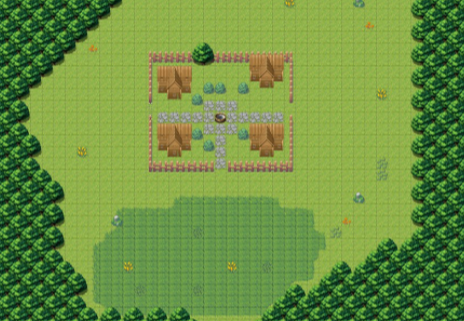
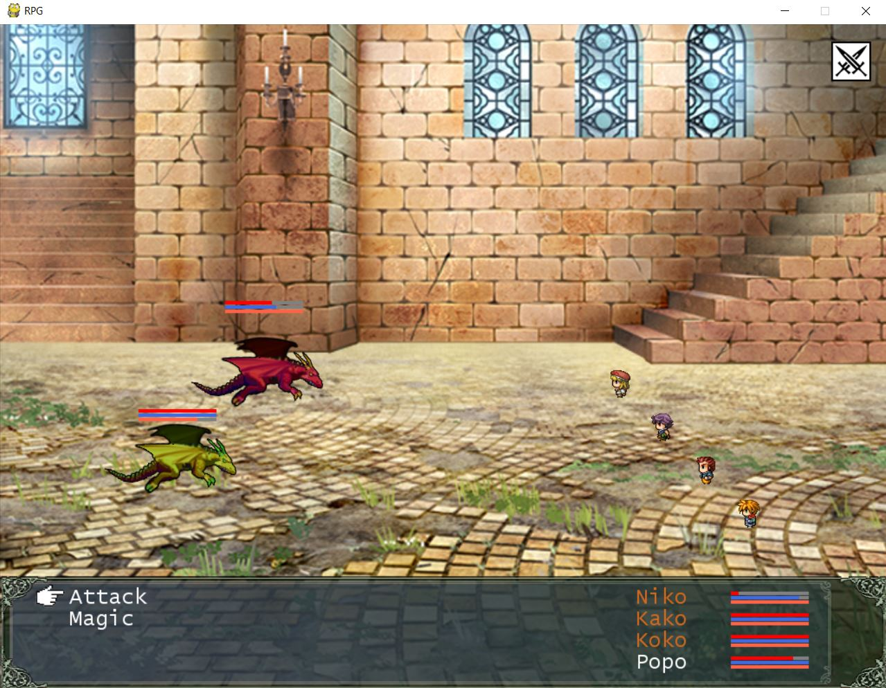

RPG-game
===

**Игра в стиле RPG созданная на pygame**

## Цели проекта
* Познакомиться с инструментами Python для создания игровых процессов
* Разобраться с работой TCP/UDP – серверов
* Написать многопользовательскую сетевую игру

## Использовал
* **pygame** - библиотека Python, предназначенный для написания компьютерных игр и мультимедиа-приложений.

  

* **pyganim** - для добавления анимаций в игру

  

* **peewee** - orm для взаимодействия с БД

  

* **sql** - СУБД для хранения информации об игроке

  

## Как это выглядит
### Меню:

### Создание персонажа:
| персонаж  | повторное имя нельзя| рандомный персонаж  |
|---|---|---|
|   |   |   |

### Настройки:

### Мир:
|таверна|город|внешний мир с драконами|
|---|---|---|
||||

### Битва:

P.S. чтобы встретить драконов, необходимо немного потусоваться на зеленой лужайке внешнего мира :)

## Инструкция
Чтобы запустить игру, запустите server_TCP.py + server_UDP.py, а затем уже Runner.py и выбирайте offline режим.

Если вы хотите запустить игру в сети, то запустите cервера server_TCP.py и
server_UDP.py на своем хосте.
Измените поле HOST в others.py на адрес вашего хоста.
Также поменяйте порты в коде, на которых теперь крутятся эти два сервера.
Затем уже запускайте Runner.py
